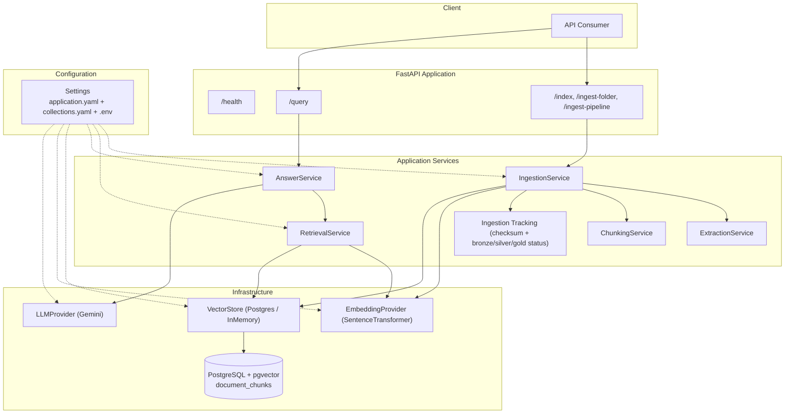
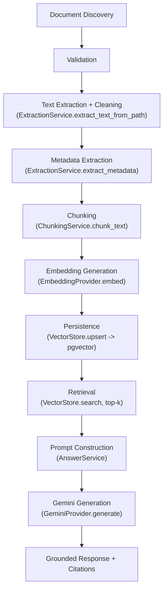
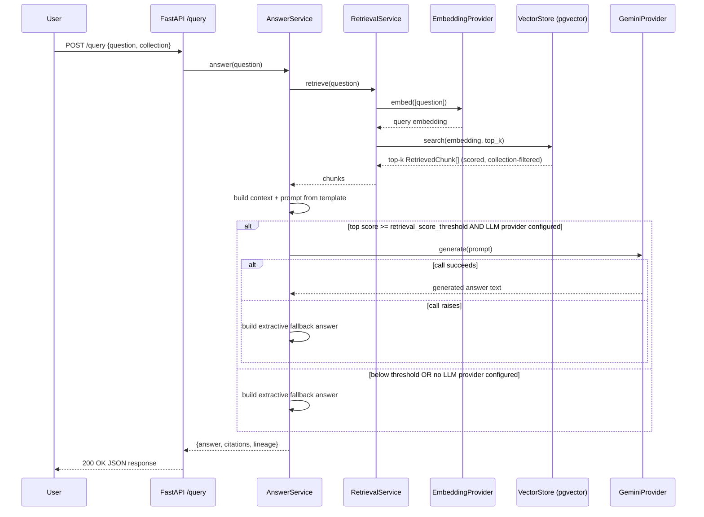
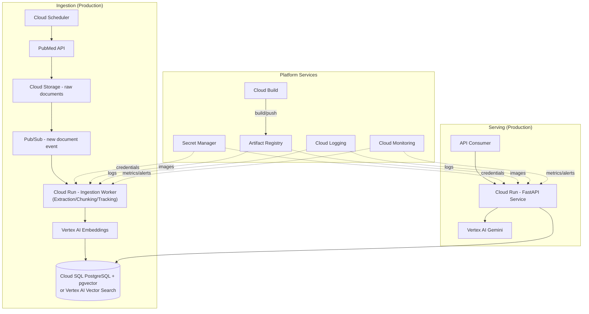

# Biomedical Research RAG Platform

## 1 Executive Summary

### 1.1 Business Problem
Biomedical research is published faster than any individual researcher, clinician, or bioinformatician can read. PubMed alone indexes tens of millions of citations across specialties, and publication volume continues to grow year over year. For any given disease — particularly a rare disease, where research is sparse, produced by small and geographically distributed research groups, and rarely consolidated into a single review — answering a specific question (for example, "What genetic mutation causes this condition?" or "What are the current first-line treatments?") requires manually locating, reading, and cross-referencing multiple papers.

This is a retrieval and synthesis problem, not a data-volume problem. The answer typically already exists in the literature; the bottleneck is finding it and stating it precisely, with a citation back to the source.

### 1.2 Why Biomedical Research Requires Semantic Retrieval
Keyword-based search — the approach used by PubMed's own search interface and most literature databases — matches queries against literal terms in title and abstract text. This breaks down in biomedical contexts for structural reasons specific to the domain:

- Biomedical terminology carries heavy synonymy and inconsistent naming (a drug's generic name, brand name, and chemical name may all refer to the same intervention across different papers).
- Research questions are typically phrased conversationally ("How is this condition diagnosed?"), not as the keyword sets that appear in abstracts.
- Relevance in biomedical text is often conceptual rather than lexical — a passage can be highly relevant to a query while sharing little vocabulary with it.

Semantic retrieval addresses this by embedding both the corpus and the query into a shared vector space and ranking by conceptual similarity rather than token overlap. This is the underlying reason retrieval in this platform is vector-based rather than keyword-based.

### 1.3 Why Retrieval-Augmented Generation (RAG)
Two alternatives were considered and rejected:

- **Pure LLM question answering, no retrieval.** The model's parametric knowledge is not traceable to a source, cannot be verified against the actual literature, and cannot be extended by adding new papers. For a domain where an unverifiable, uncitable answer has no practical value, this was not viable.
- **Pure semantic search, no generation.** Returns ranked passages but not a direct, synthesized answer — the user still has to read and interpret the results manually, which does not resolve the bottleneck in 1.1.

RAG was selected because it combines both properties: retrieval anchors every answer to specific, cited source documents (grounding), while generation synthesizes those retrieved passages into a direct answer to the user's question.

### 1.4 Project Goals
- Build a working end-to-end RAG pipeline over real biomedical literature sourced from PubMed, so that system behavior and citations are verifiable against actual publications.
- Ground every generated answer in retrieved, citable source chunks, so any claim can be traced back to a specific source article.
- Design the platform to be collection-driven and configuration-driven from the outset, so supporting an additional disease is an operational action — configuration plus document ingestion — rather than an application code change (Section 10).
- Scope the current implementation appropriately to its present stage (a single curated disease collection) while making the design decisions that allow it to scale toward a production, multi-collection, high-volume system without a rewrite (Section 13).

---

## 2 Problem Statement

### 2.1 Current Challenges
- Relevant evidence for a specific clinical or research question is scattered across dozens of independently published papers with no single canonical summary.
- Rare-disease literature in particular is low-volume and high-variance in structure (case reports, GeneReviews entries, clinical trial reports), making manual synthesis disproportionately expensive relative to the amount of text involved.
- Biomedical abstracts use dense domain vocabulary that keyword search matches poorly against natural-language questions.

### 2.2 Business Impact
- Time spent manually searching and cross-referencing literature is time not spent on research or clinical decision-making.
- In a domain where every paper on a rare disease may materially change an answer, missed or de-prioritized relevant results (a keyword-search failure mode) carry real cost.
- A system that returns a direct, cited answer converts a multi-paper reading task into a verification task, which is a substantially cheaper cognitive operation.

### 2.3 Limitations of Keyword Search
Covered in detail in Section 1.2: literal term matching fails on synonymy, phrasing mismatch between conversational questions and formal abstract language, and conceptual (non-lexical) relevance. Keyword search also provides no synthesis step — it returns documents, not answers.

### 2.4 Scope of This Project
- A working RAG pipeline covering ingestion, chunking, embedding, vector storage, retrieval, and grounded generation.
- One populated document collection (Sickle Cell Disease, ten PubMed records) demonstrating the pipeline end to end, with the collection/config architecture already in place to add further diseases without code changes.
- A REST API (FastAPI) exposing ingestion and query operations.
- An architecture and configuration design intended to generalize to production scale (documented in Section 13), even though the current deployment target is local/demonstration use.

### 2.5 Out of Scope
- Authentication, authorization, or multi-tenant access control on the API. The current endpoints are unauthenticated by design of the demonstration scope, not by oversight — this is called out explicitly here rather than left implicit, and is addressed as required production work in Sections 13 and 14.
- Automated, scheduled PubMed ingestion (current ingestion is a manual folder/path operation via the API).
- Full-text PDF corpora at production scale, multi-lingual documents, and clinical decision-support–grade validation of generated answers.
- Handling of patient-identifiable or otherwise regulated health data — the corpus is limited to already-public PubMed literature.

---

## 3 Rare Disease Overview

> **Note for author:** the rationale for selecting this specific disease is not present in the codebase or in prior project discussion. `configs/collections.yaml` defines five collections (`sickle_cell`, `wilson`, `huntington`, `cancer`, `diabetes`), but only `sickle_cell` currently has ingested documents. Replace this note with the actual reason (data availability, complexity of the literature, relevance to a specific research interest, etc.) before publishing.

### 3.1 Disease
Sickle Cell Disease.

### 3.2 Dataset
- **Source:** PubMed, retrieved directly via NCBI's E-utilities (`esearch`/`efetch`), MEDLINE format.
- **Volume:** 10 records (`data/raw/sickle_cell/`), identified by PMID: 20301551, 21131035, 27637966, 28159390, 28423290, 29542687, 30332562, 33428443, 35788790, 38661449.
- **Content:** GeneReviews and journal reviews spanning pathophysiology and clinical management, plus a 2024 NEJM report on gene therapy (exagamglogene autotemcel / exa-cel).
- **Why PubMed as source, and why real records rather than authored text:** fetching actual MEDLINE records keeps every citation in the system traceable to a real, externally verifiable PMID, rather than to synthetic or hand-written text whose "citations" would not correspond to anything a reader could independently check.

---

## 4 Functional Requirements

| ID | Requirement |
|----|-------------|
| FR1 | The system shall accept a natural language question and return a generated answer grounded in retrieved source documents. |
| FR2 | The system shall support ingestion of biomedical documents in PDF and plain-text formats. |
| FR3 | The system shall detect MEDLINE-formatted PubMed records and extract only the title and abstract fields as chunkable content, excluding bibliographic header noise. |
| FR4 | The system shall split ingested documents into overlapping, fixed-size chunks suitable for embedding and retrieval. |
| FR5 | The system shall generate vector embeddings for each chunk via a configurable embedding provider. |
| FR6 | The system shall persist chunks, embeddings, and collection assignment in a vector store supporting similarity search. |
| FR7 | The system shall retrieve the top-k most semantically similar chunks for a given query, scoped to a single collection. |
| FR8 | The system shall generate a grounded answer via an LLM provider when available, and degrade to an extractive fallback answer when no LLM provider is configured or the LLM call fails. |
| FR9 | The system shall return citation information (source id, similarity score, excerpt) alongside every generated answer. |
| FR10 | The system shall support multiple independent document collections without requiring an application code change to add a new one. |
| FR11 | The system shall support incremental ingestion, skipping documents whose content checksum is unchanged since the last successful ingestion. |
| FR12 | The system shall track per-document ingestion stage status (bronze/silver/gold) for observability. |
| FR13 | The system shall expose ingestion, query, and health-check operations via an HTTP API. |

---

## 5 Non-Functional Requirements

| Attribute | How the current design addresses it |
|---|---|
| **Scalability** | The API layer is stateless (FastAPI, no server-side session state), so it can be horizontally replicated. The `VectorStore` abstraction decouples retrieval logic from a specific storage backend, so the corpus can grow without an application rewrite. See Section 13 for the concrete scaling path and the point at which the current backend needs to change. |
| **Maintainability** | The application layer is organized as one service per pipeline stage (extraction, chunking, ingestion, retrieval, answer) rather than one class per micro-step, keeping each capability in a single, locatable file. |
| **Extensibility** | `EmbeddingProvider`, `VectorStore`, and `LLMProvider` are each defined as an abstract interface with one production implementation. Swapping the embedding model, vector database, or LLM does not require changes to ingestion, retrieval, or answer logic. |
| **Configurability** | Chunk size/overlap, retrieval top-k, similarity metric, LLM enablement/model, and retrieval score threshold are all externalized to YAML (Section 10); none of these values is hardcoded in application logic. |
| **Reliability** | LLM generation failures are caught and degrade to an extractive answer rather than failing the request, so a retrieval-grounded response is always returned even when generation is unavailable. Caveat: ingestion checksum and bronze/silver/gold status tracking are held in process memory only and are lost on restart — this is a reliability gap for production use, addressed in Section 13. |
| **Performance** | Embedding generation runs locally via `sentence-transformers` with no network round trip, keeping ingestion and query-embedding cost near-zero. End-to-end query latency is dominated by the Gemini generation call, which is the primary target for future caching (Section 14). |

---

## 6 Solution Architecture

### 6.1 Component Descriptions
- **FastAPI presentation layer:** exposes `/health`, `/index`, `/ingest-folder`, `/ingest-pipeline`, `/query`. A logging middleware records method, path, status, and duration for every request. Service graphs are resolved and cached per collection name on first use.
- **ExtractionService:** reads `.pdf` (via PyMuPDF) or `.txt` source files, normalizes whitespace/control characters, and — when it detects a MEDLINE-formatted record (`PMID-` prefix) — reduces the record to only its `TI`/`AB` fields before downstream processing. It also extracts lightweight regex-based metadata (title/authors/keywords/year) for the tracked ingestion path.
- **ChunkingService:** splits normalized text into fixed-size, overlapping character windows (defaults 500/100, overridden per collection).
- **IngestionService:** orchestrates extraction → chunking → embedding → storage, with two entry points of differing rigor (Section 8).
- **Ingestion tracking (`ingestion_tracking.py`):** SHA-256 checksum-based skip logic and bronze/silver/gold status bookkeeping, held in process memory.
- **RetrievalService:** embeds the incoming query and delegates to the configured `VectorStore` for top-k similarity search.
- **AnswerService:** builds the prompt from retrieved chunks, calls the LLM provider, and falls back to an extractive answer built directly from retrieved text if the LLM is unavailable, disabled, or the retrieval score is below a configurable threshold.
- **EmbeddingProvider (`SentenceTransformerEmbeddingProvider`):** wraps `sentence-transformers/all-MiniLM-L6-v2`, 384-dimensional, running locally.
- **VectorStore:** two implementations behind one interface — `PostgresVectorStore` (pgvector, cosine or L2 distance, filtered by `collection`) as the primary backend, and `InMemoryVectorStore` (real cosine similarity, not insertion order) as a local-development fallback when Postgres is unreachable.
- **LLMProvider (`GeminiProvider`):** wraps the Gemini API via `google-genai`.
- **Settings / configuration layer:** merges `configs/application.yaml`, `configs/collections.yaml`, and `.env` into a single `Settings` object (Section 10).

### 6.2 Current Implementation Constraints
Stated explicitly here for accuracy, and expanded in Sections 13/14 rather than silently omitted:
- No authentication/authorization on any endpoint.
- `/index`, `/ingest-folder`, and `/ingest-pipeline` accept a caller-supplied filesystem path with no restriction to a base directory.
- Ingestion checksum/status state is in-memory only and does not survive a process restart.
- No ANN index (HNSW/IVFFlat) on the `embedding` column; search is a full sequential scan, acceptable only at the current corpus size.

---

## 7 End-to-End Data Flow

**Implementation note:** in the current code, text cleaning (whitespace normalization, control-character stripping, MEDLINE TI/AB reduction) is performed *inside* the extraction step (`extract_text_from_path`), not as a separate standalone transformation stage after metadata extraction. The diagram above follows the conceptual pipeline; the mapping to actual functions is given alongside each stage so the two don't drift apart.

- **Document Discovery / Validation:** a caller-supplied path (single file or folder) is checked for existence and a supported extension (`.pdf`, `.txt`); the tracked path (`process_document`) additionally rejects documents shorter than `min_document_length` post-cleaning.
- **Text Extraction + Cleaning:** raw text is pulled from the file and normalized; MEDLINE records are reduced to title + abstract to avoid bibliographic header noise entering the index (see Section 8.5 for why this matters concretely).
- **Metadata Extraction:** regex-based extraction of title/authors/keywords/publication year, used only by the tracked ingestion path (`/ingest-pipeline`).
- **Chunking:** fixed-size overlapping character windows.
- **Embedding Generation:** local `sentence-transformers` inference, batched per document.
- **Persistence:** chunk rows (content, embedding, collection, chunk index, chunk-level metadata) are upserted into `document_chunks`.
- **Retrieval:** query embedding computed, top-k chunks retrieved via pgvector similarity search scoped to the requesting collection.
- **Prompt Construction:** retrieved chunk contents are joined and substituted into a configurable prompt template alongside the question.
- **Gemini Generation:** the constructed prompt is sent to the configured Gemini model.
- **Grounded Response:** the generated (or extractive-fallback) answer is returned together with per-chunk citations (source id, score, excerpt).

---

## 8 ELT-Inspired Ingestion Pipeline

### 8.1 Why an ELT-Inspired Approach
Traditional ETL performs transformation before any data lands in a persistent store, which means a transformation bug or ambiguous source format can silently corrupt data before it's ever inspectable. This pipeline borrows the medallion (bronze/silver/gold) *staging* discipline associated with ELT-style platforms — a document progresses through explicit, observable quality stages — but it is worth being precise about what's actually implemented: this is an **in-process, staged ETL pipeline with logical bronze/silver/gold status labels**, not a literal ELT system that lands raw bytes in the warehouse first and transforms them in place afterward. Extraction, cleaning, and chunking all happen in memory before the single persistence (load) step. The value retained from the ELT/medallion pattern is the staged, observable progression and the vocabulary for reasoning about ingestion state — not a literal "load-then-transform" execution order.

### 8.2 Logical Stages (Not Physical Storage)
Bronze/Silver/Gold in this codebase are **status labels tracked in memory** (`IngestionStatusService`), not physical folders, tables, or storage tiers. There is exactly one persisted output (the `document_chunks` row set); the stages describe *how far a given document got through processing*, for observability, not where its data physically lives at each step.

| Stage | What it represents | Implementation |
|---|---|---|
| **Bronze** | Raw document has been extracted and cleaned to plain text | `ExtractionService.extract_text_from_path` + a minimum-length validation |
| **Silver** | Document metadata has been extracted and tagged with its collection | `ExtractionService.extract_metadata`, plus `collection` / `cleaned_length` attached to the in-memory `Document` |
| **Gold** | Document has been chunked, embedded, and persisted to the vector store | `IngestionService._embed_and_store` (chunking + embedding + `VectorStore.upsert`) |

**Silver's output is not persisted anywhere, even transiently beyond the current request.** Unlike Bronze (whose output — cleaned text — flows directly into Gold as input) and Gold (whose output is written to `document_chunks`), Silver's metadata dict lives only on the in-memory `Document` object for the remainder of that single `process_document()` call. It is serialized once into the `/ingest-pipeline` HTTP response and then discarded — it is never written to `document_chunks` (see Section 9.3) or to any other store. Concretely: "Silver completed" in the status tracker means the metadata-extraction *step ran*, not that Silver's *data exists* anywhere after the response is returned. If a future consumer needs title/authors/keywords/year after ingestion completes, that requires either new columns on `document_chunks` or a separate table — neither exists today.

### 8.3 Two Ingestion Entry Points
- `index_document` / `index_folder`: the quick path — extract → chunk → embed → store, with no checksum tracking, no metadata extraction, and no stage status.
- `process_document`: the tracked path used by `/ingest-pipeline` — adds checksum-based skip, metadata extraction, and bronze/silver/gold status, sharing the same underlying extraction/chunking/embedding/storage building blocks as the quick path.

Both entry points share the same core logic rather than being two independently maintained pipelines, which removes the risk of the two paths drifting apart over time — a risk this codebase's own history records: the two ingestion paths previously existed as separate object graphs, one of which never actually persisted embeddings, before being consolidated into the current `IngestionService`.

### 8.4 Idempotent Processing and Duplicate Detection
`IncrementalProcessingService` computes a SHA-256 checksum of each source file and compares it against the last checksum recorded for that path; an unchanged file is skipped rather than re-processed, avoiding redundant embedding/storage work on repeated ingestion runs over the same corpus.

**Engineering note (identified and corrected during code review):** the original implementation of `should_skip()` wrote the freshly computed checksum into its tracking dictionary as a side effect on *every* call — including calls that correctly returned `False`. This meant that if any downstream step failed after `should_skip()` was called but before the document actually finished processing (for example, an embedding call throwing an exception), the checksum was already recorded as "seen." On retry with the same unchanged file, the document would be silently treated as already processed and skipped forever, without ever actually being embedded or stored — a correctness bug that would fail closed and silently. The fix makes `should_skip()` a pure read: only `mark_processed()`, called after a document has actually completed processing, writes to the checksum cache.

**Two further limitations, observed live while validating this pipeline end to end (not yet addressed):**
- **Checksum gating only covers the tracked path.** `index_document`/`index_folder` (the quick path) never touch `IncrementalProcessingService` at all, and `VectorStore.upsert()` is a pure `INSERT` with no conflict handling. Calling `/index` or `/ingest-folder` twice on the same unchanged file duplicates every one of its chunks, with no bound on how many times this can happen. This was reproduced directly: re-running `/ingest-folder` over an already-ingested corpus took `document_chunks` from 44 rows to 104.
- **The checksum cache is not aware of actual storage state.** It lives entirely in the `IngestionService` instance's process memory, with no link to what's actually persisted in Postgres. If `document_chunks` is cleared or restored independently of the running API process — a migration, a manual cleanup, disaster recovery — the tracked path will still report a matching checksum and skip re-ingestion, even though the document's data no longer exists anywhere. This was also reproduced directly: clearing the table without restarting the process left one document with zero persisted chunks, silently, because its (now-stale) checksum still matched. The fix in both cases requires the same restart to clear in-memory state; a production-grade fix would move this tracking onto storage itself (e.g., a `content_hash` column on `document_chunks`) rather than process memory.

### 8.5 Why Metadata/Content Extraction Matters in Practice
Raw MEDLINE records lead with roughly fifteen lines of bibliographic bookkeeping (PMID, ISSN, volume/issue, dates) before the actual title/abstract content. Early in this project, chunking treated the entire record as plain text, so the first chunk of every article was pure header noise — and that noise embedded close enough to disease-name queries to win top-k retrieval slots over substantive content. Concretely, the query "How is sickle cell disease diagnosed?" once returned "no information provided" even though a full diagnosis section existed in the corpus, because 4 of 5 retrieved chunks were header blocks rather than the chunk that actually discussed diagnosis. This is a direct, verifiable example of why source-format-aware cleaning is not optional in a RAG pipeline: retrieval quality is only as good as what actually gets chunked.

**Known limitation (unaddressed):** the regex-based metadata extractor looks for human-authored `Title: ... Authors: ...` phrasing and does not understand MEDLINE's `TI  -` / `FAU -` tag format. `title`/`authors` therefore come back empty for PubMed-ingested records via `/ingest-pipeline`, even though that data is available post-extraction. This affects only pipeline metadata output, not retrieval or answer correctness, since retrieval/answer logic never depends on these fields.

---

## 9 Database Design

### 9.1 Why a Single, Denormalized Table
The current implementation stores every chunk — across every collection — as one row in a single `document_chunks` table, distinguished by an indexed `collection` column filtered on every query, rather than one table per document or one table per collection.

This is appropriate at the current scale (ten documents, one collection with data) for concrete reasons:
- The system's actual read pattern is "fetch the top-k most similar chunks, scoped to one collection" — a query that needs no joins to satisfy, since every field the retrieval/answer path consumes (`content`, `source_id`, `score`, chunk-level `metadata`) lives on the chunk row itself.
- Adding a new disease collection is a configuration and ingestion action (a block in `collections.yaml`, documents in `data/raw/<disease>/`), never a schema migration, because collections share one table rather than each getting its own.
- There is exactly one vector index to create and maintain regardless of how many collections exist, once an index is added (Section 13) — not one per collection.

### 9.2 Schema

| Column | Type | Description |
|---|---|---|
| `id` | Integer, primary key | Surrogate row identifier. |
| `collection` | String, indexed | Disease/collection this chunk belongs to; every retrieval query filters on this column, which is what makes a shared table safe against cross-collection leakage. |
| `source_id` | String | Identifier of the source document the chunk was extracted from (the document's filename stem, e.g. a PMID for PubMed sources). Multiple rows share the same `source_id` when a document produces multiple chunks; there is no separate document-level row. |
| `chunk_index` | Integer | Ordinal position of this chunk within its source document. |
| `content` | Text | The chunk's text content — what gets embedded and what gets returned as a citation excerpt. |
| `embedding` | `Vector(embedding_dimension)` (pgvector) | The chunk's embedding vector. Dimension is config-driven (`embedding_dimension`, default 384) and must match whatever `embedding_model` actually produces. |
| `chunk_metadata` | Text | Chunk-level metadata only — currently `{char_start, char_end}` from the chunking step, stored as a Python `str(dict)` and parsed back on read via `ast.literal_eval`. |

### 9.3 What Is *Not* Currently Persisted
Document-level metadata (title, authors, keywords, publication year) is computed by `ExtractionService.extract_metadata` during the tracked ingestion path and is returned in the `/ingest-pipeline` API response, but it is **not written to `document_chunks`** — the chunk rows produced during embedding/storage carry only `{char_start, char_end}` metadata, not the document-level fields. This is a factual description of current behavior, not a recommendation; whether a documents table or an additional JSONB column is the right fix is a production-architecture question addressed in Section 13, per project scope for this section.

### 9.4 How pgvector Stores and Queries Embeddings
`embedding` uses pgvector's `Vector` SQLAlchemy type, storing each chunk's embedding as a native fixed-length vector column. Similarity search runs as a SQL `ORDER BY embedding <=> :query_embedding LIMIT :k` (cosine) or `<->` (L2), with the operator selected by the configurable `similarity_metric` setting; the resulting distance is converted to a similarity score in the query itself (`1 - distance` for cosine, `-distance` for L2). At the current corpus size, this executes as a full sequential scan — there is no HNSW/IVFFlat index yet, which is acceptable only because the corpus is small enough that scan cost is negligible (Section 13 discusses exactly where this stops being true).

### 9.5 Engineering Note: `chunk_metadata` Serialization
Storing `chunk_metadata` as a Python `str(dict)` representation (parsed via `ast.literal_eval`) rather than as native JSON/JSONB is a coupling worth flagging: it works today because both the write and read paths are Python, but it means the column cannot be queried with Postgres's native JSON operators, and `ast.literal_eval` will reject anything that isn't valid Python literal syntax — a real constraint if a future non-Python producer ever writes to this table. A `JSONB` column would remove this coupling with no loss of functionality.

---

## 10 Configuration Strategy

### 10.1 Configuration Hierarchy
Settings are assembled by `Settings.from_yaml()` in a defined precedence order:

1. **`configs/application.yaml` → `default:`** — base values applied regardless of environment.
2. **`configs/application.yaml` → `environments:<APP_ENV>`** — environment-specific overrides (`APP_ENV` env var, defaults to `local`), e.g. `debug: true` locally vs. `false` in `prod`.
3. **`configs/collections.yaml` → `<collection_name>`** — per-collection overrides (chunk size/overlap, retrieval top-k), applied last so a collection's tuning always wins over the environment/global default.
4. **Environment variables / `.env`** — `DATABASE_URL` and `GEMINI_API_KEY` are deliberately excluded from both YAML files and come only from the environment, so that a committed configuration file can never silently override real deployment credentials. (This constraint exists because of a prior incident: an old environment-specific YAML file hardcoded a `DATABASE_URL` that silently beat the `.env` value and pointed at a Postgres role that didn't exist.) Merged non-secret YAML values are pushed into `os.environ` via `setdefault`, so real environment variables always take precedence over anything defined in YAML.

### 10.2 Why Configuration-Driven Architecture Enables Adding a Disease Without a Code Change
Every value that varies by collection — chunk size, chunk overlap, retrieval top-k — is externalized to `collections.yaml`, keyed by collection name, with the collection name itself derived from the YAML key rather than a field inside the block (so it cannot drift out of sync with its own key). Because retrieval, ingestion, and chunking logic all read these values from `Settings` rather than hardcoding them, adding a new disease is: add a block to `collections.yaml`, place documents in `data/raw/<disease>/`, call `/ingest-folder` or `/ingest-pipeline`. No application code changes, and no schema migration, because collections share the single `document_chunks` table (Section 9).

---

## 11 Retrieval Pipeline

**Why the threshold and fallback exist:** the retrieval score threshold (`retrieval_score_threshold`, default `0.0`/disabled) exists to let low-confidence retrievals skip the LLM call entirely rather than risk a fluent but ungrounded answer. It is left disabled by default deliberately: live validation on this corpus showed a correct, on-topic answer scoring as low as 0.287 (an obscure drug name against a general-purpose embedding model) while a genuinely out-of-scope question scored 0.392 — higher. There is no threshold in that range that reliably separates "right answer, obscure vocabulary" from "wrong topic" on this embedding model, so an aggressive default would silently suppress correct answers rather than only incorrect ones; the value should only be tuned after inspecting real score distributions for a given corpus and query pattern. The extractive fallback (a canned summary built from raw retrieved text) exists so that grounding is never lost even when generation is skipped, disabled, or fails — only fluency is lost.

---

## 12 Design Decisions and Trade-offs

| Decision | Reason | Alternative | Trade-off |
|---|---|---|---|
| **PostgreSQL + pgvector** | One system serves both relational metadata and vector search, avoiding a second database to operate for a corpus this size. | Dedicated vector database (Pinecone, Qdrant) | Simpler operations now; no ANN index yet, so it will need one (or a managed alternative) before the corpus grows much further (Section 13). |
| **Single shared table (`document_chunks`)** | Adding a collection is a config change, not a schema change; one vector index to maintain regardless of collection count. | One table per collection | Requires every query to filter on `collection` to preserve isolation; verified live that a query scoped to one collection never returns another's chunks. |
| **Sentence Transformers (`all-MiniLM-L6-v2`)** | Runs locally, no per-call cost or external API dependency, fast enough for interactive ingestion/query. | A domain-tuned biomedical embedding model (e.g. PubMedBERT-based) | Likely lower retrieval precision on specialized terminology than a biomedical-tuned model; swapping is a one-line config change since embedding sits behind `EmbeddingProvider`. |
| **Gemini (`gemini-flash-lite-latest`)** | Managed generation without hosting a model; `flash-lite` specifically chosen for its higher free-tier daily quota after hitting the standard `flash` tier's 20-request/day cap during testing. | Self-hosted open-weight LLM | External dependency and per-call cost/latency at production volume; behind an `LLMProvider` interface so the provider is swappable without touching `AnswerService`. |
| **FastAPI** | Async-capable, typed request/response models via Pydantic, minimal boilerplate for a small number of endpoints. | Flask, Django REST Framework | Fewer built-in conveniences (auth, admin) than a batteries-included framework — acceptable given the current unauthenticated, single-purpose API scope. |
| **No LangChain / hand-rolled interfaces** | The pipeline's steps (extract, chunk, embed, store, retrieve, generate) are well-understood and static; direct interfaces (`EmbeddingProvider`, `VectorStore`, `LLMProvider`) keep the dependency surface minimal and every step easy to trace and test without framework indirection. | LangChain / LlamaIndex | More code to own directly (retrieval and prompt orchestration are hand-written), in exchange for full visibility and control over exactly what happens at each pipeline step. |
| **Configuration-driven architecture** | Chunk size, top-k, similarity metric, and LLM behavior all vary by collection/environment without code changes. | Hardcoded per-collection logic or per-collection code branches | Requires discipline to keep all tunables externalized; one prior incident (a hardcoded `DATABASE_URL` in an environment YAML silently overriding `.env`) shaped the current secrets-stay-out-of-YAML rule. |
| **Collection-driven architecture** | New diseases are added via config + document ingestion, never a schema or code change. | Separate deployable service per disease | Keeps operational surface to one service and one schema; relies on the shared table's `collection` filter for isolation rather than physical separation. |
| **ELT-inspired ingestion pipeline (bronze/silver/gold status)** | Gives ingestion staged, observable progress and a place to attach checksum-based idempotency, without the ceremony of physically materializing intermediate stage outputs. | Literal ELT (land raw documents, transform in the warehouse) | The bronze/silver/gold labels are logical status only, tracked in memory — not a literal load-then-transform pipeline, and not currently persisted across a process restart (Section 13). |

---

## 13 Production Scalability on Google Cloud Platform

### 13.1 From Current Architecture to Production Architecture

### 13.2 Component Mapping

| Local Component | Production (GCP) | Why |
|---|---|---|
| `data/raw/<disease>/` folder | Cloud Storage | A folder on a developer machine is not a durable, shareable landing zone; Cloud Storage gives durable, versioned, access-controlled raw document storage. |
| Manual `/ingest-folder` call | Pub/Sub + Cloud Scheduler-triggered PubMed pulls | Decouples "new document available" from processing, enabling asynchronous, retryable, and scheduled ingestion instead of a synchronous API call the caller has to remember to make. |
| `uvicorn` process (`main.py`) | Cloud Run (FastAPI service) | Stateless container, autoscaling, no server management; matches the API layer's existing statelessness (Section 5). |
| Ingestion logic (`IngestionService`) | Cloud Run ingestion worker, invoked via Pub/Sub push | Separates the ingestion workload (bursty, batch-oriented) from the query-serving workload (latency-sensitive), so one doesn't starve the other's resources. |
| `SentenceTransformerEmbeddingProvider` | Vertex AI Embeddings | Removes the need to host and scale an embedding model on the serving container; already a one-line swap since embedding sits behind `EmbeddingProvider`. |
| `GeminiProvider` (API-key auth) | Vertex AI Gemini (IAM-based auth) | Removes a long-lived API key from application configuration in favor of GCP-native identity, consistent with Secret Manager below. |
| Local PostgreSQL | Cloud SQL for PostgreSQL (with pgvector) | Same schema and `VectorStore` implementation; adds managed backups, HA, and patching without an application change. |
| — | Vertex AI Vector Search (conditional) | Replaces Cloud SQL/pgvector for the vector-search workload specifically, once corpus scale justifies it (Section 13.3). |
| `.env` | Secret Manager | Managed, audited, rotate-able secret storage in place of a local file; credentials injected via IAM at runtime. |
| — | Artifact Registry | Stores built container images for Cloud Run deployment. |
| — | Cloud Build | CI: build, test, and push a new image on every commit. |
| `RotatingFileHandler` local file logging | Cloud Logging | Cloud Run containers have an ephemeral filesystem, so file-based logging doesn't survive a restart; the same structured log statements the app already emits are redirected to Cloud Logging instead. |
| Manual log inspection | Cloud Monitoring | Dashboards and alerts on latency, error rate, and retrieval score distributions, rather than reading log files after the fact. |

### 13.3 When to Replace pgvector with Vertex AI Vector Search
While the vector count stays in the low millions and latency/throughput requirements are moderate, pgvector inside Cloud SQL should be preferred: it keeps ingestion, metadata, and vector search in one system with one connection model and standard relational tooling. The switch to a dedicated managed vector search service is justified when either:
- vector count grows beyond what a single Cloud SQL instance's ANN index can serve within an acceptable query latency at the required query throughput, or
- index maintenance cost (e.g., a full re-embed after an embedding model upgrade) becomes operationally expensive on a database not designed for that workload.

At that point, the architecture would typically split: Cloud SQL/PostgreSQL retains document/chunk metadata and ingestion lineage, while Vertex AI Vector Search holds the embedding index itself, joined by chunk/document id at query time — because a purpose-built vector search service is designed to scale ANN indexing independently of a transactional workload, which a general-purpose relational database extended with a vector type is not.

### 13.4 Scaling Discussion

| Corpus size | State of this architecture |
|---|---|
| **10 papers (current)** | pgvector sequential scan is negligible cost; even the in-memory fallback store is viable for local development. |
| **100 papers** | Still comfortably within sequential-scan territory; no index needed yet. |
| **10,000 papers** | On the order of hundreds of thousands of chunks. This is the point at which sequential scan latency starts to matter under real query volume — adding an HNSW or IVFFlat index on `embedding` (already flagged as the first scaling action in this project's own architecture notes) stops being optional. |
| **100,000 papers** | Several million chunks. Single-instance vertical scaling and ANN index build/maintenance time become real operational concerns; ingestion throughput (embedding generation, not storage) becomes the likely bottleneck. A well-resourced Cloud SQL instance with a tuned index may still be viable, alongside read replicas for query traffic. |
| **Millions of papers** | Tens of millions of chunks — the scale at which Vertex AI Vector Search (Section 13.3) becomes the appropriate choice over a general-purpose relational database with a vector extension. |

### 13.5 Production Trade-offs
- Splitting ingestion and serving into separate Cloud Run services adds operational surface (two deployables instead of one) in exchange for independent scaling and failure isolation.
- Moving from API-key-based Gemini access to Vertex AI's IAM-based access removes a class of credential-leak risk but ties the deployment more tightly to GCP's identity model.
- Introducing Vertex AI Vector Search adds a second data system to operate (alongside Cloud SQL for metadata), which is only worth the added complexity once corpus scale actually requires it (Section 13.3) — introducing it prematurely would trade simplicity for capability the system doesn't yet need.
- None of these production changes require changes to `EmbeddingProvider`, `VectorStore`, or `LLMProvider` consumers, since ingestion, retrieval, and answer logic depend only on the interfaces, not the concrete implementations — this is the direct payoff of the interface boundaries chosen in Section 6.

---

## 14 Future Enhancements

- **Incremental ingestion / PubMed API automation:** replace manual folder ingestion with a scheduled pull from PubMed's E-utilities per collection, using the existing checksum-based skip logic to process only new or changed records.
- **Hybrid search:** combine keyword/BM25 matching with vector similarity to catch exact-term matches (drug names, gene identifiers) that a general-purpose embedding model may under-rank.
- **Cross-encoder reranking:** re-score the top-N retrieved chunks with a cross-encoder before generation, to improve precision at the point where it matters most — right before the LLM call.
- **Docker:** containerize the application for consistent local, CI, and cloud execution.
- **CI/CD:** automated test execution and deployment (Cloud Build, per Section 13) on every commit.
- **Authentication:** the current API is unauthenticated by explicit scope decision (Section 2.5); adding authentication/authorization is required before any deployment reachable by untrusted callers, since the current `/index` path also accepts an arbitrary server-local filesystem path with no restriction.
- **Caching:** cache repeated questions/answers, since Gemini generation is the dominant latency and cost driver (Section 5).
- **Monitoring:** structured metrics and alerting on retrieval score distributions, LLM failure rate, and query latency (Cloud Monitoring, Section 13).

---

## 15 Demo Walkthrough

1. **Problem Statement** — the literature-synthesis bottleneck for rare-disease research (Section 1–2).
2. **Disease Overview** — the Sickle Cell Disease dataset: source, volume, content (Section 3).
3. **Architecture** — walk the component diagram; emphasize the interface boundaries (`EmbeddingProvider`, `VectorStore`, `LLMProvider`) and why they exist (Section 6).
4. **Data Flow** — trace a document from raw file to indexed chunk (Section 7), including the MEDLINE header-noise story as a concrete example of why extraction quality matters (Section 8.5).
5. **Database** — the single-table design and why it's appropriate at this scale, plus the honest note on what metadata isn't yet persisted (Section 9).
6. **Retrieval** — the query sequence diagram, and the reasoning behind the disabled-by-default score threshold (Section 11).
7. **Live Demo** — run an actual query end to end through the API; show the returned answer and citations.
8. **Design Decisions** — the trade-off table (Section 12), including the specific reasoning for rejecting LangChain and choosing a single shared table.
9. **Production Scalability** — the GCP mapping and the scaling discussion (Section 13), including the concrete answer to "when would you replace pgvector."
10. **Q&A**
