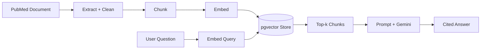
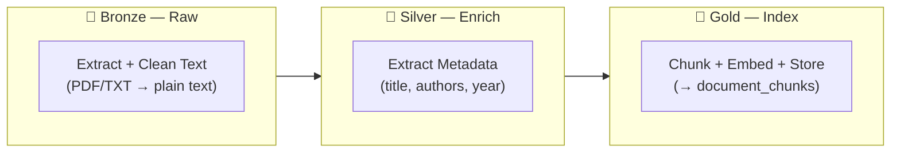

# Biomedical Research RAG Platform — Architecture Summary

## Overview

A Retrieval-Augmented Generation pipeline that answers natural language questions over biomedical research literature (PubMed) with cited, source-grounded answers. RAG was chosen over a pure LLM (answers wouldn't be traceable to a source) and over pure semantic search (returns passages, not a direct answer) — it's the only approach that gives both a synthesized answer and a citation trail back to the literature.

**About the disease:** Sickle Cell Disease is an inherited blood disorder caused by a mutation in the *HBB* gene, which causes red blood cells to form a rigid, crescent ("sickle") shape instead of their normal flexible disc shape. These misshapen cells block blood flow, causing pain crises, chronic anemia, and progressive organ damage, and require lifelong management. It's a well-suited domain for this platform: decades of literature — from foundational pathophysiology to a 2024 gene therapy report (exa-cel) — spread across sources that are rarely consolidated into a single reference.

Current scope: one populated collection (Sickle Cell Disease, 10 PubMed records), built on a collection-driven, configuration-driven architecture so additional diseases are a config + ingestion action, not a code change.

---

## 1. Ingestion & Embedding

Turns raw articles into a searchable knowledge base:

- **Extract:** PDF (PyMuPDF) or plain text; MEDLINE-formatted PubMed records are detected automatically and reduced to just their title/abstract fields, stripping ~15 lines of bibliographic header noise per record.
  - *Why it matters:* early on, that header noise was chunked and embedded like real content, and occasionally out-ranked the actual answer in top-k retrieval — one query returned "no information provided" despite the answer existing in the corpus. Source-aware cleaning fixed this at the root.
- **Chunk:** fixed-size, overlapping character windows (default 500/100 chars, tunable per collection).
- **Embed:** `sentence-transformers/all-MiniLM-L6-v2`, local inference, no API cost.
- **Store:** PostgreSQL + pgvector, one shared `document_chunks` table across all collections, isolated by an indexed `collection` column filtered on every query.
- **Idempotency:** SHA-256 checksum per file — unchanged documents are skipped on re-ingestion rather than reprocessed.

### Storage Schema

One shared PostgreSQL table (`document_chunks`) holds every collection, isolated by the `collection` column — no separate table per disease, no separate documents table.

| Column | Type | Purpose |
|---|---|---|
| `id` | Integer, PK | Row identifier |
| `collection` | String, indexed | Disease/collection scope — filtered on every query |
| `source_id` | String | Source document id (e.g. PMID); multiple rows share one `source_id` |
| `chunk_index` | Integer | Chunk's position within its source document |
| `content` | Text | Chunk text — what gets embedded and returned as a citation excerpt |
| `embedding` | Vector(384), pgvector | The chunk's embedding; dimension is config-driven |
| `chunk_metadata` | Text | Chunk-level metadata (`char_start`, `char_end`) |

### Ingestion Stages — Bronze / Silver / Gold

Logical status labels tracked for observability, not physical storage tiers — every document lands in the same `document_chunks` table once it reaches Gold.

Each stage is checksum-gated: an unchanged document is skipped before Bronze even starts.

**Note:** only Gold's output survives. Silver's metadata (title/authors/year) is extracted, used once in the API response, and then discarded — it is not written to `document_chunks` or any other store. "Silver: completed" means the step ran, not that Silver's data exists anywhere afterward.

### Adding a New Disease

No code or schema change required — purely a configuration and data action:

1. Add a block to `configs/collections.yaml` under a new key (chunk size, overlap, top-k).
2. Place source documents in `data/raw/<disease>/`.
3. Call `/ingest-folder` (quick path) or `/ingest-pipeline` (tracked path, with checksum + Bronze/Silver/Gold status) for that collection.
4. Query it via `/query` with `"collection": "<disease>"`.

## 2. Retrieval

- The question is embedded with the same model used at ingestion time, so query and corpus live in the same vector space.
- pgvector cosine similarity search returns the top-k most relevant chunks, scoped to the requesting collection (`top_k` and similarity metric are both config-driven).
- No ANN index yet — a full scan, which is fine at this corpus size and the first thing to add before scaling further (Section 5).

## 3. Answer Generation

- Retrieved chunks are joined into a context block and substituted into a prompt template alongside the question, then sent to Gemini (`gemini-flash-lite-latest`).
- If generation is disabled, the API key is missing, the call fails, or the top retrieval score is below a configurable confidence threshold, the system falls back to an extractive answer built directly from the retrieved text — grounding is never lost, only fluency.
- Every answer returns citations: source id (PMID), similarity score, and excerpt, so any claim can be traced back to a specific article.

## 4. Design Decisions & Trade-offs

| Decision | Why | Trade-off accepted |
|---|---|---|
| PostgreSQL + pgvector, single table | One system for metadata + vectors; adding a disease is a config change, not a schema change | No ANN index yet — needs one before the corpus grows much further |
| Local Sentence Transformers embeddings | Free, fast, no external dependency for a small corpus | A biomedical-tuned model would likely improve precision on specialized terms; swappable via one interface |
| Gemini with extractive fallback | Managed generation without hosting a model; fallback guarantees grounding even when generation is unavailable | External dependency, and the dominant cost/latency driver |
| No LangChain | Pipeline steps are static and well-understood; direct interfaces keep every step traceable and testable | More hand-written orchestration in exchange for full visibility |
| Configuration- and collection-driven | Chunk size, top-k, and per-disease tuning all live in YAML, not code | Requires discipline to keep new tunables externalized rather than hardcoded |

## 5. Scaling to Production

- **Immediate next step at any real scale:** add an HNSW/IVFFlat index on the `embedding` column — today's sequential scan is only acceptable at ten documents.
- **Compute/serving:** containerize and run on Cloud Run (stateless API already fits this); move ingestion to Pub/Sub-triggered workers instead of a manual API call, fed by scheduled PubMed pulls.
- **Embeddings/generation:** swap in Vertex AI Embeddings and Vertex AI Gemini — both are one-line changes since they sit behind existing provider interfaces.
- **Vector store:** pgvector on Cloud SQL remains the right choice into the low millions of chunks; beyond that, Vertex AI Vector Search is justified once ANN index latency/maintenance on a single Postgres instance becomes the bottleneck — not before, since it's a second system to operate.
- **Secrets/security:** move `.env` to Secret Manager; add authentication — the current API is intentionally unauthenticated for this demonstration scope and would need auth before touching any untrusted network.

## 6. Known Limitations (Current Implementation)

- No authentication on the API; `/index` accepts a caller-supplied filesystem path with no restriction — acceptable for local demonstration, not for a deployed environment.
- Ingestion checksum/status tracking is in-memory only and does not survive a restart.
- Document-level metadata (title/authors) is extracted but not yet persisted alongside chunks — retrieval and answer quality are unaffected, since neither depends on it.
- The quick ingestion path (`/index`, `/ingest-folder`) has no deduplication — `VectorStore.upsert()` is a pure insert, so re-ingesting the same file through this path duplicates its chunks. Only the tracked path (`/ingest-pipeline`) is checksum-gated.
- The tracked path's checksum cache lives in process memory, not in the database — if the vector store is cleared or restored independently of the running API process, it can incorrectly skip re-ingesting documents whose data no longer exists, until the process restarts.
